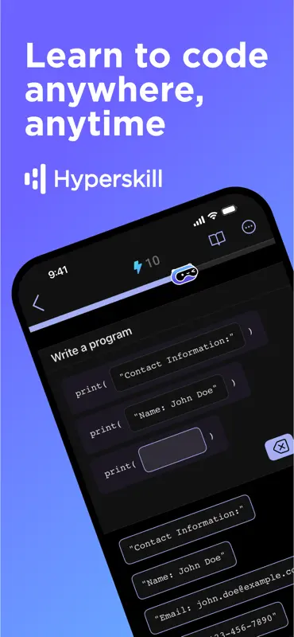
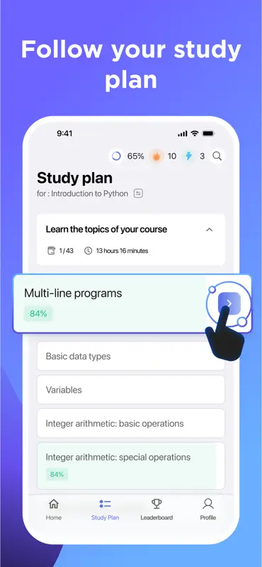

# Hyperskill Mobile App

Master coding on-the-go with [Hyperskill](https://hyperskill.org/)! Immerse yourself in curated lessons, keep your streak, and sharpen your knowledge with 3000+ hands-on topics. Hyperskill is the ultimate app to learn programming languages and technologies, offering over 50 courses and 300+ projects that cater to all levels of expertise.

Features:
* **Curated Learning Experience:** Dive into lessons that are structured to guide you from beginner to expert.
* **Wide Range of Topics:** Learn Java, Python, Kotlin, JavaScript, Go, Data Science, SQL, Django, Spring, Scala, and more.
* **Hands-On Projects:** Apply your knowledge through 300+ real-world projects.
* **Progress Tracking:** Keep your learning streak going with daily reminders and track your progress easily.

## Installation

|Android|iOS|
|:-:|:-:|
|  |  |

## Tech Stack

We use Kotlin Multiplatform Mobile (KMM) to share code between Android and iOS.

### Shared

|Category|Library|
|:-:|:-:|
|Networking|[Ktor](https://github.com/ktorio/ktor)|
|Serialization|[Kotlinx Serialization](https://github.com/Kotlin/kotlinx.serialization)|
|Local Storage|[Multiplatform Settings](https://github.com/russhwolf/multiplatform-settings)|
|Asynchronous|[Kotlinx Coroutines](https://github.com/Kotlin/kotlinx.coroutines)|
|Architecture|[Clean](https://hackmd.io/@eadm/BJg82eA7N)|
|Dependency Injection|Manual|
|Presentation|[The Elm Architecture](https://github.com/eadm/AndroidKit/tree/master/presentation/presentation-redux)|
|Build configuration|[BuildKonfig](https://github.com/yshrsmz/BuildKonfig)|
|Crash Reporting / Performance Monitoring|[Sentry](https://sentry.io/)|
|Resources|[Moko Resources](https://github.com/icerockdev/moko-resources)|
|Code Generation|[Feature Generator](https://github.com/hyperskill/mobile-feature-template-plugin)|

### Android

|Category|Library|
|:-:|:-:|
|Navigation|[Cicerone](https://github.com/terrakok/Cicerone)|
|UI|[Jetpack Compose](https://developer.android.com/jetpack/compose)|
|Parcelable|[Serialization Parcelable](https://github.com/chRyNaN/serialization-parcelable)|

### iOS

|Category|Library|
|:-:|:-:|
|UI|[SwiftUI](https://developer.apple.com/xcode/swiftui/)|
|Image Loading|[Nuke](https://github.com/kean/Nuke)|
|SVG|[SVGKit](https://github.com/SVGKit/SVGKit)|

## Support

If you encounter any issues or have questions, please open an issue in the repository, or contact our support team at hello@hyperskill.org.

## Acknowledgements

This project is developed and maintained by the Hyperskill team. We welcome contributions and feedback from the community.
